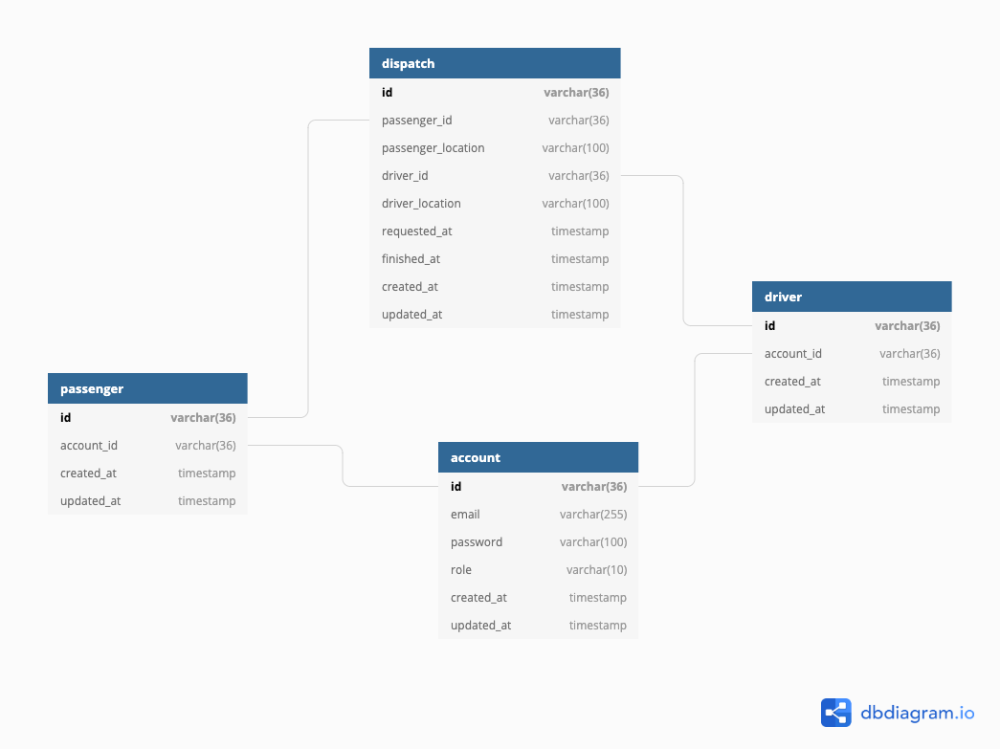

# taxi-dispatch-system

> MVP REST API for TDS (Taxi Dispatch System)

## Getting started

### Prerequisites

* [node.js](https://nodejs.org/) 8+ (LTS recommended)
  * (optional) [nvm](https://github.com/nvm-sh/nvm) node version manager 
* [sqlite](https://www.sqlite.org/download.html)

```bash
brew install sqlite3
```

* [yarn](https://classic.yarnpkg.com/en/docs/install)

```bash
brew install yarn
```

### Setup

* copy `.env`
```bash
cp .env.example .env

# edit values
```
* install node modules
```bash
yarn
```

### Getting started

* Run server

```bash
yarn start
```

* Open swagger UI
  * http://localhost:8080/

### Assumption
* 사용자는 택시기사와 승객이 동시에 될 수 없다.
* 사용자는 1개의 이메일만 사용한다.

## Modeling

### Database



## Deployment
* https://www.netlify.com/

## Resources

### Database design
* [Database diagram](https://dbdiagram.io/d/5fd9d0d79a6c525a03bb4524)

### API design
* [Brief api design](api_list.md)
* API spec (Swagger UI)
  * [Localhost](http://localhost:8080/)
  * [Netlify](http://netlify.com/) - need update url
